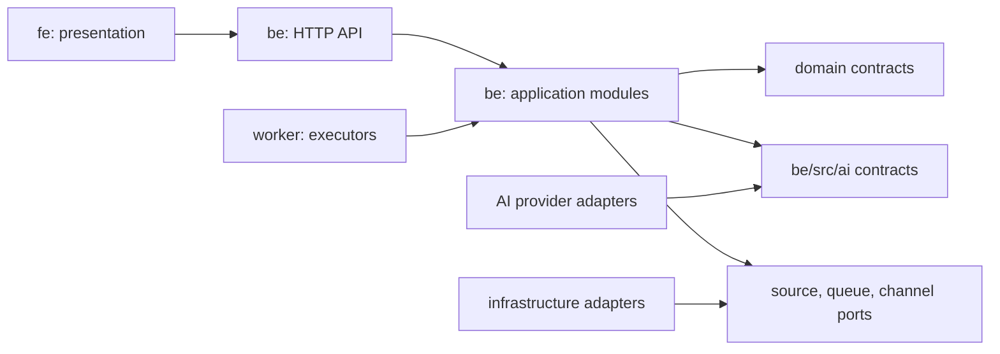
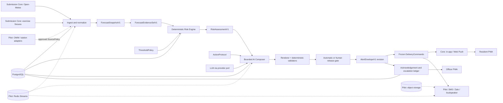
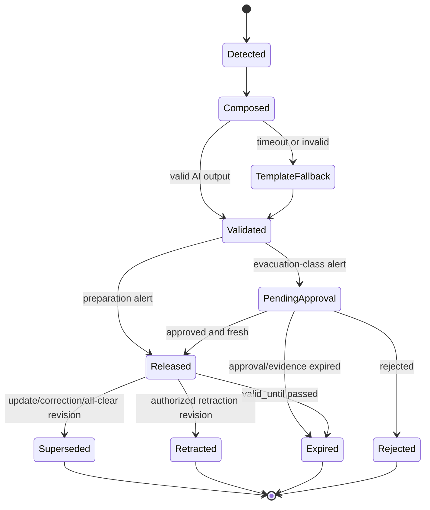
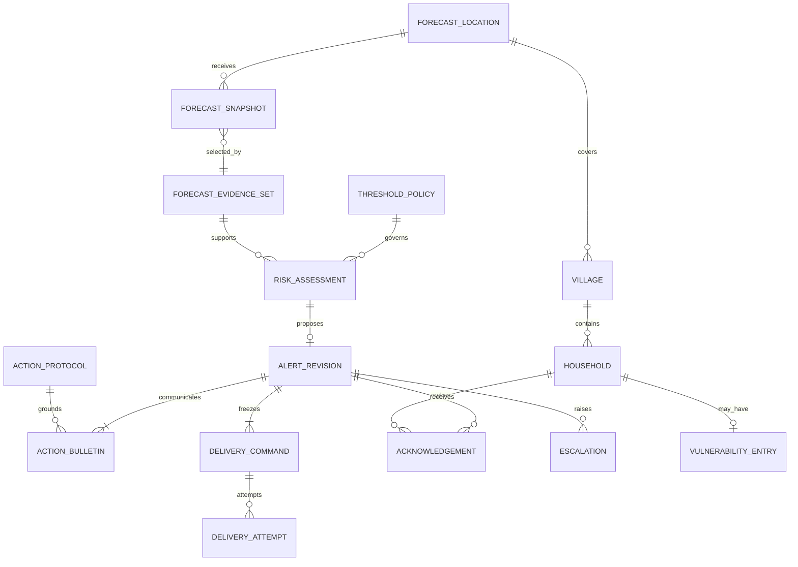

# Architecture Spine — WeatherBridge AI

## Design Paradigm

**Event-driven pipes-and-filters with hexagonal adapters.** Forecast evidence
flows through typed, independently testable stages. Provider and delivery
integrations sit behind ports. Deterministic code controls safety decisions;
bounded AI transforms approved evidence into understandable communication.



## Delivery Profiles & VAIC Acceptance Gate

The profiles below are binding. A later profile constrains design now but is not
competition-time implementation work unless it is explicitly named in the
earlier profile.

| Profile | Purpose | Non-negotiable outcome | Explicitly not required in that profile |
| --- | --- | --- | --- |
| **Submission Core** | Meet eligibility in 36 hours | One complete, safe, rehearsed vertical slice | Pilot-grade transport, offline sync, commercial channels, real household data, physical loudspeaker |
| **Submission Differentiator** | Earn innovation/safety points after Core passes | Human relay/eval and, only if approved, exercise-localized audio | Production language claims or a paid-pilot TTS dependency |
| **Pilot Contract** | Govern any real-world use | Full lifecycle, authority, privacy, reliability, provenance, and channel controls | None of its gates may be waived for a real warning |

### Submission Core Acceptance Gate

The team cannot call the submission complete until all six proofs exist:

1. A 3-7 day forecast is visibly available for at least three Điện Biên
   locations. The planned five seeded locations and seven-day view exceed this.
2. A predefined threshold automatically produces one `PREPARE` alert from the
   same normalized data contract used by the forecast view. Frost/cold is the
   only claimable live-like hazard in the submission.
3. A 360px resident card communicates action and deadline first through the two
   public levels (`PREPARE`, `GO_NOW`), color, icon, and simple language; a
   second layer shows source and supporting numbers.
4. The four-part bulletin passes deterministic validation or visibly takes the
   validated template fallback; no output can change fact, level, deadline,
   action, or destination.
5. The architecture spine, one-page deck, scorecard, and a timed demo script
   exist. The complete scenario runs in under two minutes three times.
6. All submission data and recipients are synthetic/exercise-only. A failure
   drill covers stale source data and AI timeout.

### Competition Assumptions

- **[ASSUMPTION, resolves before live use]** Open-Meteo plus fixtures is the
  submission source set. OpenWeatherMap and station data are ports, not active
  evidence sources until their credentials, terms, and `SourcePolicy` are
  approved.
- **[ASSUMPTION, resolves by team owner before H18]** Web Push is Submission
  Core because the formal PRD Must tier requires it. In-app alert/polling is a
  rehearsed demo fallback, not evidence that push was delivered.
- **[ASSUMPTION, resolves before any non-exercise claim]** Local-language
  templates/audio are `exercise_only` unless a native-language reviewer and
  licence/consent record explicitly approve them for live use.
- **[ASSUMPTION, resolves before Pilot]** Escalation timings, action lead time,
  threshold authority, evacuation approver, and buyer/operator are not facts
  until confirmed with the responsible local authority.

## Invariants & Rules

### AD-1 — Preserve deployable modular-monorepo boundaries [ADOPTED]

- **Binds:** all capabilities and deploy units
- **Prevents:** premature microservices and duplicated product logic across processes
- **Rule:** `fe` owns browser UI, `be` owns HTTP and application/domain logic,
  `be/src/ai` owns online AI contracts/adapters, `worker` executes asynchronous
  application work, `ai` owns offline datasets/evaluation/training, and `infra`
  owns packaging/deployment only. The existing deploy boundaries are adopted.
  The current generic `ai_jobs` worker/table mirror is legacy scaffold, not a
  WeatherBridge pattern: new WeatherBridge workers call backend application
  services or a shared internal contract package and never mirror ORM tables or
  business rules. Retire or migrate the legacy path before Pilot.

### AD-2 — Make forecast evidence canonical, strict, and source-policy governed

- **Binds:** FR-1, FR-2, FR-7, FR-11, FR-12
- **Prevents:** provider-shaped domain models, untraceable numbers, double altitude correction, stale data appearing safe, and incompatible multi-source selection
- **Rule:** adapters validate raw responses into immutable strict
  `ForecastSnapshotV1` records (`extra = forbid` or equivalent). A snapshot
  carries source/product/model run, issue time, valid interval, retrieved time,
  expiry, source and target coordinates/elevation, canonical values/units,
  completeness, raw-payload digest/reference, ordered transform chain,
  attribution/terms record, and `is_exercise`. `FreshnessPolicy` calculates
  eligibility; adapters never set a trusted boolean themselves. Downscaling uses
  provider elevation correction or one versioned local lapse-rate transform,
  never both.

  Submission Core uses `SourcePolicyV1`: Open-Meteo is the sole authoritative
  forecast source and a fixture is the sole exercise source. OWM/station data
  cannot silently change a Core assessment. Pilot policy explicitly defines
  per-hazard/horizon maximum age, provider role, required variables, quality
  range, failover, disagreement, switchback, and unknown/degraded behavior.
  Every `RiskAssessment` pins its frozen evidence set and source-policy revision.
  Without eligible evidence the system creates no new automatic assessment,
  shows prior data as stale, and raises an operational failure rather than a
  safe state.

### AD-3 — Separate machine evidence, deterministic decisions, and human authority [ADOPTED]

- **Binds:** FR-3, FR-4, FR-6 and all life-critical warnings
- **Prevents:** LLM-selected severity/deadline and unauthorized evacuation orders
- **Rule:** a deterministic Risk Engine alone produces a strict
  `RiskAssessmentV1`: evidence-set ID, immutable threshold-policy revision,
  matched rule/evidence references, public level, scope, phenomenon interval,
  action lead time, deadline, dedupe key, supersession key, and exercise flag.
  `ThresholdPolicyV1` defines units, required fields, operator/equality behavior,
  aggregation window, missing-data behavior, valid horizon, release class, and
  deadline formula. Policy/protocol revisions move only through
  `draft -> reviewed -> approved -> active -> retired`; activation is atomic and
  assessment creation pins the active revision. Selection resolves exactly one
  explicitly approved match using declared scope precedence; a policy/protocol
  may fall back only to a named approved fallback. No match is a configuration
  failure, never a model decision. Policies are immutable/effective-dated,
  approved by their named authority, and covered by boundary test vectors.

  `PREPARE` may release automatically. `GO_NOW` enters `PendingApproval`; only
  an authorized commune official may release or reject it, and release must
  recheck evidence freshness and approval validity. A stale, expired, or
  superseded pending assessment cannot transition to `Released`.

### AD-4 — Retrieve actions from approved protocols, not model memory

- **Binds:** FR-5, FR-8, FR-9, FR-20
- **Prevents:** invented safety advice and unsafe semantic-nearest retrieval
- **Rule:** actions and evacuation destinations come from a curated,
  immutable/effective-dated `ActionProtocolV1` selected deterministically by
  hazard, public level, occupation, locality, and exercise/live scope. It has
  stable action/destination IDs, source authority/citation, author/reviewer/
  approver, locale-template references, expiry, and supersession link. The MVP
  uses relational lookup, not vector similarity. AI may arrange approved actions
  but may not create, replace, infer vulnerable households, or approve protocols.

### AD-5 — Treat AI composition as an anchored, typed, fail-safe transform

- **Binds:** FR-5, FR-24
- **Prevents:** free-form output, changed facts, prompt injection, provider lock-in, and AI outages blocking warnings
- **Rule:** the Composer receives only strict `CompositionRequestV1` with
  approved IDs, bounded locality/occupation context, and a privacy class. It
  returns `CompositionDraftV1`: four bounded language segments and immutable
  fact/action references, never model-authored values, levels, deadlines,
  actions, destinations, or instructions. A deterministic renderer inserts all
  critical facts from the assessment/protocol; final validation produces
  `ValidationReportV1` and rejects unsupported claim classes, unknown fields,
  channel-length overflow, or altered references. Tool use, remote retrieval,
  and provider prompt augmentation are disabled for this task.

  Any invalid result or 10-second timeout becomes the validated deterministic
  template path. Prompt digest, requested and actual provider/model identity,
  inference parameters, schema, protocol, renderer, validator, and release ID
  travel with every result. AI is evaluated against the template baseline for
  communication benefit but never gains safety authority.

### AD-6 — Localize life-critical content through reviewed templates

- **Binds:** FR-15, FR-16
- **Prevents:** unreviewed runtime translation, unvalidated audio/text, and per-household TTS cost
- **Rule:** `ValidatedBulletinV1` becomes `LocalizedBulletinV1` only through an
  approved locale/dialect/script template set with typed render variables. The
  final localized projection validates critical number/time/place/action/
  destination variables, template approval scope, and channel length before
  release. Every locale asset carries template digest, reviewer, effective time,
  licence/consent record, and `exercise_only` or `live` approval.

  Thái TTS runs only in `worker` and produces content-addressed `AudioAssetV1`
  records; Mông/Hmong uses consented recorded segments in the MVP. Audio lineage
  includes localized-text digest, voice/model or segment-set version, renderer,
  checksum, duration, and offline QA version. Machine translation is an
  authoring aid only. TTS failure cannot suppress the validated text alert; a
  voice-dependent live recipient requires a preapproved attention-audio/manual-
  relay fallback. No contest language asset is described as live-approved.

### AD-7 — Make internal state atomic and external effects explicit

- **Binds:** ingestion, composition, audio, delivery, escalation, reporting
- **Prevents:** lost jobs, duplicate state transitions, database/queue split-brain, and impossible exactly-once channel promises
- **Rule:** internal PostgreSQL state transitions are transactional and handlers
  are idempotent by event ID plus operation key. Pilot uses transactional outbox
  plus Redis Streams consumer groups: consumers acknowledge after completion,
  reclaim stale pending work, cap retries, quarantine poison events, and alarm
  on queue age. Events carry owner, schema version, aggregate ID, monotonic
  aggregate revision, causation ID, and trace ID; consumers reject unsupported
  schema versions and stale aggregate revisions.

  Submission Core may retain the existing Redis-list worker only for synthetic
  background/demo jobs. It must expose terminal failure and domain dedupe, and
  must not claim durable at-least-once or external delivery guarantees.

  Channels are never promised exactly-once. Each adapter declares provider
  idempotency support, attempt intent, bounded retry, ambiguous-outcome state,
  receipt reconciliation, and severity-specific duplicate-versus-omission
  policy. An external acceptance with lost response remains `ambiguous` until
  reconciled; it is not silently treated as unsent or delivered.

### AD-8 — Give each state one owner and one durable source of truth

- **Binds:** all shared data
- **Prevents:** conflicting mutations and Redis becoming unrecoverable business state
- **Rule:** backend application modules exclusively mutate their entities in
  PostgreSQL. Redis contains cache and recoverable transport only. HTTP routes
  and workers call application services; neither mutates another module's tables
  directly. Submission Core may use a local artifact volume behind the same
  `ArtifactStore` port; Pilot uses managed object storage. Cross-module reads use
  explicit application queries/projections, never another module's repository or
  ORM model.

### AD-9 — Freeze alert revisions, audience, and channel commands

- **Binds:** FR-14, FR-17 through FR-22
- **Prevents:** channel failures corrupting alert truth, profile drift during fan-out, and uncorrectable released warnings
- **Rule:** `AlertEnvelopeV1` is an immutable revision with `valid_from`,
  `valid_until`, status, evidence/assessment/protocol/release references, and
  `supersedes`/`superseded_by` links. Only an authorized actor can issue update,
  correction, retraction, expiry, or all-clear revisions; every such revision is
  propagated to channel and accountability views. A channel adapter never edits
  an alert and can map a frozen revision one-way to CAP 1.2.

  Release freezes affected villages, recipient/cohort membership, locale,
  bulletin variant, protocol/destination revision, channel intent, and the
  delivery command. Adapters consume frozen `DeliveryCommandV1` records; they do
  not re-derive audience or safety content from mutable household profiles. Each
  adapter records an independent `DeliveryAttempt`; a channel failure never rolls
  back another channel or the alert revision.

### AD-10 — Version, release, and roll back the complete AI task

- **Binds:** FR-24 and every AI/prompt/protocol change
- **Prevents:** unmeasured prompt drift, mutable model aliases, non-reproducible demo claims, and unsafe rollback
- **Rule:** a content-addressed `AiTaskReleaseV1` moves only through
  `draft -> evaluated -> approved -> active -> retired/revoked`. Its immutable
  manifest binds schemas, prompt/context-builder digests, requested and actual
  provider/model, inference parameters, validator/renderer/fallback digests,
  provenance, dataset/eval-report IDs, source commit, cost/privacy policy, and
  approver. An atomic environment pointer selects one approved active release;
  each job snapshots that ID at start. Rollback moves only that pointer to a
  retained approved release and never silently rolls back an independently
  effective `ThresholdPolicy` or `ActionProtocol`.

  Submission Core requires one reviewed immutable release, a golden report, and
  a rehearsed fallback. Pilot additionally requires rollback rehearsal and
  alarms for validator escape, model identity drift, fallback/latency/cost breach,
  and privacy-policy failure. Deterministic safety checks pass per case and per
  slice; LLM-as-judge is advisory and cannot be the sole gate.

### AD-11 — Scope identity and sensitive household data by locality

- **Binds:** FR-9, FR-19 through FR-23
- **Prevents:** cross-village disclosure and demo authentication becoming a production shortcut
- **Rule:** Submission Core uses seeded Keycloak official/admin identities and
  synthetic, pre-bound resident personas; it does not build resident registration,
  recovery, or real household credential lifecycle. Pilot uses revocable,
  household-scoped credentials without browser token persistence and checks role
  plus locality on every operation. Release/retraction authority requires fresh
  authentication, explicit actor/reason/evidence, and a configurable delegation
  policy.

  Repository/demo data are synthetic. Before any real data, a deny-by-default
  field allowlist, purpose/legal basis or consent, retention/deletion, access
  audit, encryption/key ownership, provider data-use terms, and approved
  exceptions are required. No household name, contact detail, precise household
  coordinate, vulnerability reason, or acknowledgement history enters a model
  provider request by default.

#### Authorization and Scope Matrix

`sub` is the canonical identity key. Keycloak supplies roles; backend locality
assignment records are the sole scope authority, not free-form group paths.
Commands/events carry `actor_type`, `actor_id`, and an authorization snapshot;
workers use a service principal and never replay an end-user bearer token.

| Principal | Scope | Permitted action |
| --- | --- | --- |
| `resident_device` | One synthetic/Core or assigned/Pilot household | Read its frozen alerts; submit its own acknowledgement. |
| `village_official` | Explicit assigned `village_id` set | Maintain manual vulnerability entries; act on assigned visits; submit `visited`/`not_found`. |
| `commune_official` | Explicit assigned `commune_id` and derived village set | Approve/reject/retract `GO_NOW`, receive escalation, view/export commune evidence. |
| `admin` | Configuration authority only | Manage policy/protocol/locale drafts; cannot release/retract a `GO_NOW` unless separately assigned `commune_official`. |
| `system_worker` | Service principal only | Execute approved background commands; cannot originate human approval or acknowledgement. |

Pilot release/retraction requires fresh authentication and captures actor, reason,
evidence, locality scope, and authority revision. Delegation/emergency access is
disabled until a named authority approves its workflow and audit requirements.

### AD-12 — Carry provenance and one trace across the decision chain

- **Binds:** reliability, audit, reporting, and AI evidence
- **Prevents:** black-box incidents, unsupported claims, and accidental sensitive-data telemetry
- **Rule:** one `trace_id` links fetch, transform, assessment, composition,
  validation, approval, delivery, acknowledgement, escalation, and revision.
  Telemetry records source age, queue age, policy/prompt/model/protocol versions,
  validator/fallback result, latency, token cost, and channel outcome. Logs and
  AI traces deny household-sensitive content by default; an exception needs an
  approved field allowlist, reason, retention, and access audit.

  Before any provider, dataset, prompt, recording, model, or evaluation artifact
  is used, `ArtifactProvenanceRecord` captures owner, purpose, source/version or
  digest, licence/terms/attribution, privacy/cost review, transmitted fields,
  retention, and limitations. Telemetry references provenance records; it does
  not replace them.

### AD-13 — Isolate exercises end to end

- **Binds:** FR-7 and every outbound/reporting path
- **Prevents:** simulated alerts reaching real recipients or polluting production evidence
- **Rule:** exercise data uses the same contracts and pipeline, but `is_exercise`
  is immutable and visible on every artifact. Exercise alerts can target only
  allowlisted demo destinations and remain partitioned in reports, metrics, and
  accountability views. An exercise revision or localized asset can never be
  promoted to live status merely by changing a UI label.

### AD-14 — Keep HTTP responsive and offline work outside runtime APIs [ADOPTED]

- **Binds:** all runtime and deployment environments
- **Prevents:** provider/training latency in HTTP, mock AI in production, and replica-start migrations
- **Rule:** API replicas serve commands/queries only; workers execute schedules,
  provider calls, TTS, and long-running work; `ai` remains offline-only.
  Offline evaluation imports the exact online contracts/renderers/validators
  rather than copying them. Migrations run as a release step. Secrets come from
  environment-specific secret stores. A mock provider is allowed only for a
  visibly labelled `is_exercise` path; Pilot/production startup fails if it is
  selected or if required provider configuration is absent.

### AD-15 — Make safety contracts executable and compatible

- **Binds:** all application, AI, API, event, and frontend boundaries
- **Prevents:** a return to generic `text -> dict`, incompatible producer/consumer shapes, and prose-only validation
- **Rule:** application services exchange only strict, named `V1` contracts:
  `ForecastSnapshot`, `ForecastEvidenceSet`, `RiskAssessment`, `ActionProtocol`,
  `CompositionRequest`, `CompositionDraft`, `ValidationReport`,
  `LocalizedBulletin`, `AudioAsset`, `AlertEnvelope`, and `DeliveryCommand`.
  Contracts have stable IDs, closed enums, bounded fields, explicit required/
  optional values, schema version, and `extra = forbid` behavior. A producer
  emits one declared version; a consumer declares accepted versions; unknown
  versions are rejected rather than guessed. Generic provider payloads remain
  private to the adapter.

### AD-16 — Make human relay, time authority, and accountability explicit

- **Binds:** FR-13, FR-18 through FR-22
- **Prevents:** inferred vulnerability, clock manipulation, escalation races, and mutable accountability history
- **Rule:** `VulnerabilityEntry` is created/changed only by authorized officials;
  no model infers it. `EscalationPolicy` owns X/Y/Z timings, immediate
  `NotFound` escalation, status vocabulary, and effective-time revision. Server
  time plus transactional compare-and-set owns acknowledgement/escalation state;
  device time is separate labelled evidence with clock-quality metadata. A late
  acknowledgement never rewrites an emitted escalation. Visit assignments freeze
  their household/reason/location/sample phrase at alert release.

  The accountability ledger is application-append-only: database roles deny
  update/delete to runtime writers, each row carries prior-record hash, and
  approvals/retractions/exports include actor, reason, evidence, and trace ID.
  Pilot additionally rehearses ledger verification and restore/export access.

### AD-17 — Keep the public two-level action UX stable across services

- **Binds:** FR-6, FR-10 through FR-16
- **Prevents:** API/frontend severity drift and a data-heavy interface that hides the action
- **Rule:** public levels are exactly `PREPARE` and `GO_NOW`; `GO_NOW` alone may
  use the red sound/vibration. Every active resident view renders action and
  deadline first, then source/freshness/supporting numbers by progressive
  disclosure. The primary card fits a 360px viewport without scrolling and has
  at most two action lines. `safe`, `unknown`, and `stale` are distinct states.
  Acknowledgement changes the household's follow-up state but does not erase the
  alert or its evidence.

### AD-18 — Bind time budgets and degraded behavior before Pilot

- **Binds:** scheduler, queue, composition, delivery, officer workflow, and demo
- **Prevents:** background jobs starving urgent alerts and recovered work emitting obsolete advice
- **Rule:** Submission Core proves one full scenario in under two minutes. Pilot
  evaluates forecast/risk at least every 60 minutes; eligible evidence to
  released alert has a five-minute target; registered Web Push has a one-minute
  target; and a `GO_NOW` task outranks normal composition/TTS work. Targets are
  measured end-to-end and reported as achieved/failed, never assumed from a
  provider SLA. Jobs past alert validity/deadline are cancelled or converted to
  an explicit expired revision, never delivered as current.

  Source failure creates `unknown/stale`, LLM failure takes deterministic
  fallback, queue failure alarms the operator and stops stale release, and
  channel failure records a delivery outcome without changing alert truth. Pilot
  must set RPO/RTO, queue-age alarm owners, backup restore evidence, and
  low-connectivity delivery procedure before live operation.

### AD-19 — Enforce safety architecture with shared fitness gates

- **Binds:** CI, release process, demo preflight, and Pilot readiness
- **Prevents:** rules existing only in prose
- **Rule:** a change cannot pass its applicable profile without deterministic
  fixtures for threshold boundaries, units, deadline/timezone, stale/partial
  evidence, exercise isolation, strict schemas, validator/fallback, alert
  revision, authorization scope, duplicate/reordered events, and critical
  locale variables. Submission Core runs the subset required by its vertical
  slice; Pilot additionally proves retry ambiguity, offline clock skew,
  authorization step-up, ledger verification, queue recovery, rollback, and
  backup restore. The scorecard may claim a point only when its evidence link
  exists and the relevant gate passes.

### AD-20 — Keep pilot operating and commercial constraints configurable

- **Binds:** Pilot topology, locality onboarding, language assets, and business claims
- **Prevents:** a contest-only configuration becoming an undeployable B2G offer
- **Rule:** the first live deployment is isolated to one commune and operated by
  the named local authority. Forecast locations, villages, thresholds, action
  protocols, recipient cohorts, channels, and locale assets onboard through
  approved configuration, not a code fork. Low-connectivity behavior is an
  operating procedure backed by offline officer workflow and an approved
  fallback channel. Any CC-BY-NC or otherwise non-commercial TTS/model is
  exercise-only; a paid pilot needs a separately licensed/consented replacement
  before it is offered commercially.

## Consistency Conventions

| Concern | Convention |
| --- | --- |
| Domain names | Singular PascalCase contracts; snake_case Python/modules, JSON fields, and PostgreSQL tables. |
| Contracts | Pydantic/TypeScript schemas are strict, versioned, generated from OpenAPI at browser boundaries, and reject unknown fields. |
| Events | Past tense, versioned: `<domain>.<entity>.<event>.v<N>`; payload includes `event_id`, `aggregate_id`, `aggregate_revision`, `causation_id`, `trace_id`, `occurred_at`, `schema_version`, `is_exercise`. |
| Identity | UUIDv4 identifiers; idempotency keys are explicit strings scoped by operation. |
| Time | Store UTC, serialize ISO 8601 with offset, render in `Asia/Ho_Chi_Minh`; deadline calculations use timezone-aware values only. |
| Geography | WGS84 coordinates; forecast locations and villages have explicit elevation in metres and source. |
| Units | Celsius, millimetres, metres/second, metres, percent; adapters convert before persistence. |
| API | `/api/v1`; typed request/response schemas; generated frontend client; errors include stable `code`, human-safe `message`, and `trace_id`. |
| State mutation | Submission Core: application service + transaction + visible terminal job state. Pilot: application service + PostgreSQL transaction + outbox; no route, worker, or channel adapter writes domain tables directly. |
| Configuration | Environment variables for deployment; immutable/effective-dated database records for source/threshold/escalation policies, action protocols, locale assets, and AI releases. |
| Safety copy | No value, severity, deadline, action, or destination enters public copy unless it exists in validated structured input. |
| Attribution | Store and display source attribution; Open-Meteo output is attributed under CC BY 4.0. Every external artifact has an `ArtifactProvenanceRecord` before use. |
| Profiles | Every endpoint, task, test, diagram node, and scorecard claim is marked `submission_core`, `differentiator`, or `pilot`; pilot claims never appear as demo evidence. |

## Stack

| Name | Version |
| --- | --- |
| Python | 3.12 |
| Node.js | 24 |
| pnpm | 11 |
| FastAPI | 0.139.2 |
| SQLAlchemy | 2.0.51 |
| PostgreSQL | 16 |
| Redis Server | 7 |
| redis-py | 6.4.0 |
| React | 19.2.7 |
| TypeScript | 5.9.3 |
| Vite | 8.1.4 |
| Keycloak | 26.5.2 |
| LiteLLM gateway | 1.81.13-stable |
| OASIS Common Alerting Protocol | 1.2 |

The table is the repository-locked baseline, not a claim that every item is the
latest upstream release. Security/patch review occurs before Pilot; release
metadata records immutable image digests and lockfile hashes.

## Structural Seed

### Runtime Flow



### Alert Release State



Every correction, all-clear, expiry, or retraction is a new immutable revision
linked to its predecessor; no released content is edited in place.

### Core Ownership Shape



### Source Layout

```text
be/src/
  modules/
    weather/          # source ports, normalized forecasts, freshness
    risk/             # thresholds, assessments, deadlines, release gate
    localities/       # forecast locations, villages, households
    alerts/           # alert lifecycle and public query models
    delivery/         # channel ports and delivery attempts
    accountability/   # acknowledgements, visits, escalation, reports
  ai/
    bulletins/        # typed composer, validators, fallback, task bundle
    localization/     # reviewed template and TTS contracts
    providers/        # LiteLLM/mock adapters
worker/src/
  tasks/              # ingest, assess, compose, dispatch, TTS, escalation
ai/
  datasets/           # synthetic/golden scenarios and provenance
  evals/              # deterministic and model-assisted evaluations
fe/src/
  features/forecast/
  features/alerts/
  features/officer/
  shared/api/         # generated OpenAPI client
```

### Module Ownership

| Module | Exclusively owns mutations | May read through |
| --- | --- | --- |
| `weather` | sources, snapshots, evidence sets, freshness/source policies | published weather projections |
| `risk` | threshold policies, assessments, deadline/release classification | weather evidence interface |
| `localities` | locations, villages, household profiles, manual vulnerability entries | locality query interface |
| `alerts` | alert aggregate, release gate, alert revisions, frozen cohorts, bulletin allocation, delivery commands | risk/locality projections; `RiskAssessmentProposed` handoff |
| `delivery` | channel registrations and delivery attempts | frozen delivery commands only |
| `accountability` | acknowledgement, visit, escalation, append-only ledger | frozen assignments and alert revisions |
| `be/src/ai` | AI release manifests, composition/validation/localization runtime artifacts | strict application contracts only; returns validated artifacts to `alerts` |

### Environment Envelope

- **Local/demo and Submission Core:** Docker Compose, synthetic households,
  exercise allowlist, one API/worker, local artifact volume, seeded five-location
  data, visible mock/exercise labels, preflighted fallback, and a timed scenario.
  A local reverse proxy/TLS setup is optional and cannot displace the acceptance
  gate.
- **Pilot:** separate API/worker scaling, managed PostgreSQL/Redis/object store,
  external secrets, backups, privacy retention jobs, delivery-provider service
  credentials, outbox/Streams, alerts/SLO monitoring, RPO/RTO, migration release
  job, and restore evidence. Cloud vendor remains open.

### Profile Control Matrix

| Control | Submission Core | Submission Differentiator | Pilot |
| --- | --- | --- | --- |
| Data | Synthetic + exercise-only | Synthetic + exercise-only | Approved real data only after privacy/legal gate |
| Forecast source | Open-Meteo + fixture | Same | SourcePolicy-approved OWM/station/failover |
| AI provider | Visible exercise/mock or approved demo route | Same, with eval evidence | No mock; approved active release only |
| Channels | In-app + preflighted Web Push | Exercise local audio if approved | Provider-contract-approved channels |
| Queue | Current worker with terminal status/dedupe | Same | Outbox + Streams + recovery/DLQ |
| Identity | Seeded official/admin + synthetic residents | Same | Locality-scoped credentials and fresh approval auth |
| Deployment | Compose, one preflighted demo environment | Same | Expand/contract migrations, deploy/drain order, skew policy, rollback |
| Claim | Demo/exercise only | Demonstrated differentiator only | Live-pilot readiness after all gates |

## Capability → Architecture Map

| Capability / Area | Profile | Lives in | Governed by |
| --- | --- | --- | --- |
| FR-1, FR-2, FR-7, FR-11, FR-12 — forecast and scenarios | Submission Core | `weather`, resident forecast UI | AD-2, AD-13, AD-15, AD-17 |
| FR-3, FR-4, FR-6 — thresholds, assessment, deadline | Core; `GO_NOW` approval is Differentiator/Pilot | `risk` | AD-3, AD-15, AD-18 |
| FR-5 — four-part grounded bulletin | Submission Core | `be/src/ai/bulletins` | AD-4, AD-5, AD-10, AD-15 |
| FR-24 — automated eval | Differentiator; Core has golden safety subset | `be/src/ai`, `ai/evals` | AD-5, AD-10, AD-19 |
| FR-8, FR-9 — village/household context | Core seed data; edit workflows later | `localities` | AD-4, AD-8, AD-11, AD-15 |
| FR-10 through FR-13 — resident experience | Submission Core | `alerts`, `fe/features/alerts` | AD-5, AD-9, AD-16, AD-17 |
| FR-14 — Web Push | Submission Core after in-app path; measured, not assumed | `delivery`, `worker/tasks` | AD-7, AD-9, AD-13, AD-18 |
| FR-15, FR-16 — local language/audio | Differentiator, exercise-only unless approved | `be/src/ai/localization`, worker TTS | AD-6, AD-10, AD-19 |
| FR-17 — SMS/Zalo | Pilot or credential-backed stretch | `delivery` | AD-7, AD-9, AD-20 |
| FR-18 through FR-22 — human relay/evidence | Differentiator; full offline workflow Pilot | `accountability`, officer UI | AD-7, AD-9, AD-11, AD-12, AD-16 |
| FR-23 — identity and roles | Core seeded Keycloak; full lifecycle Pilot | Keycloak, backend authorization | AD-11, AD-14 |

## Deferred

- **Before real-world pilot:** confirm contracts, rights, update cadence, and
  quality for the Điện Biên station and historical disaster datasets.
- **Before real-world pilot:** name and approve the authority for thresholds,
  escalation policy, evacuation release/retraction, and operational alarms.
- **Before any non-exercise language claim:** validate Thái and Mông/Hmong
  templates with native speakers and obtain consent/licences for every recording
  and model. `facebook/mms-tts-blt` remains contest-only while CC-BY-NC applies.
- **Before each external channel is enabled:** obtain its provider contract and
  configure idempotency, receipt, ambiguous-send, retry, and retention behavior.
- **Before Pilot Streams are enabled:** define per-task lease/heartbeat, timeout
  taxonomy, retry/backoff ceiling, stream/group ACL, quarantine owner, durable
  replay window, and outbox publish/prune/rebuild procedure.
- **Before Pilot offline PWA is enabled:** define API compatibility window,
  enum-evolution rule, assignment cursors/tombstones, per-item sync response,
  idempotency-key retention, and client deployment skew policy.
- **Before Pilot:** select cloud/on-premises target and secret manager after RPO,
  RTO, SLO, backup, restore, and incident ownership requirements are accepted.
- **When a partner requires interoperability:** define the local CAP 1.2 profile;
  the core remains provider-neutral until then.
- **When volume or geospatial queries justify them:** evaluate TimescaleDB,
  PostGIS, and dedicated event brokers; they are not MVP prerequisites.
- **After labeled outcomes exist:** evaluate calibrated multi-source ensembles,
  learned threshold adjustment, community sensor reports, and local TTS
  training. No forecasting model is trained for the competition MVP.
- **Capability limit:** flash-flood and landslide paths remain clearly labelled
  exercises or rainfall-risk indicators until authoritative local maps,
  thresholds, and observations are validated. The submission never claims to
  predict either phenomenon accurately.
