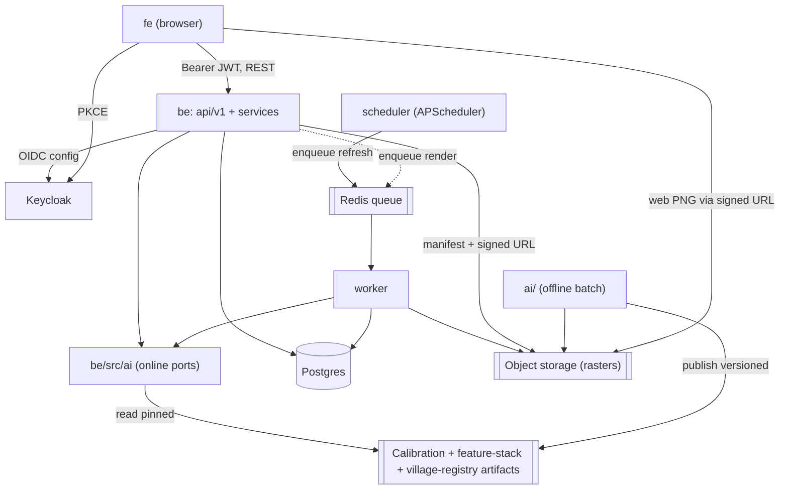
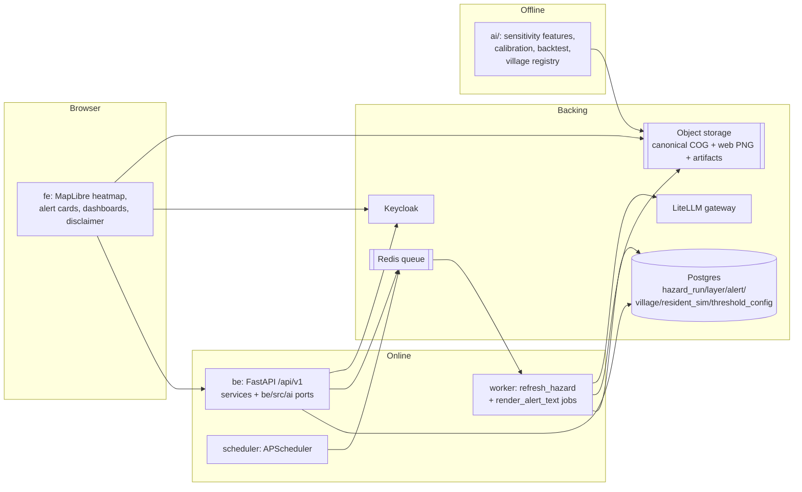
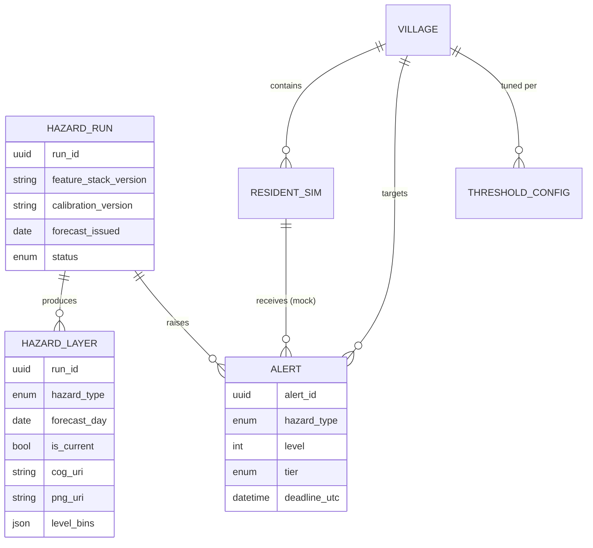

# Architecture Spine — WeatherBridge AI (MVP)

This spine sits on an existing, coherent monorepo scaffold (Keycloak auth, FastAPI async
API, Redis-queued worker, offline `ai/` workspace, LiteLLM/Langfuse). That scaffold was built
for a **generic text→JSON AI job**; the hazard/heatmap product does not exist in code yet. The
spine therefore **ratifies** the infrastructure conventions already in the repo and **fixes the
new invariants** the hazard domain needs so the pipeline, API, worker, and UI can be built in
parallel without diverging.

## Design Paradigm

Three composable ideas, each mapped to existing directories:

- **Layered service core (ports & adapters).** Thin HTTP routes → application services → domain
  ports (Python `Protocol`s) → adapters. This is the pattern already in `be/` (`api/v1` →
  `services/` → `ai/contracts.py` Protocols → `ai/providers/*`). All new domain work extends it;
  it is not replaced.
- **Deterministic pipes-and-filters hazard pipeline.** Hazard risk is a staged, pure transform:
  `DEM + land cover → terrain/sensitivity features → per-type rain trigger → hazard score → 5
  levels → 2 tiers → alerts`. Each stage is a filter with an explicit input/output contract; the
  same input always yields the same output.
- **Offline (batch) / online (serving) split.** Heavy, run-once geospatial work lives in `ai/`
  and is published as versioned artifacts. Online serving (`be/src/ai` + `worker/`) only *applies*
  those artifacts to fresh forecasts. This is the existing `ai/` ↔ `be/src/ai` boundary, made
  load-bearing for the hazard pipeline.

Layer → directory map:

| Paradigm element | Directory |
| --- | --- |
| HTTP transport / routes | `be/src/api/v1/` |
| Application services | `be/src/services/` + `be/src/modules/<domain>/` |
| Online domain ports & adapters | `be/src/ai/` (hazard scoring, alert-text renderer, forecast client, zonal stats) |
| Async execution | `worker/src/` (refresh + render jobs) |
| Offline batch pipeline | `ai/src/` (terrain/sensitivity features, calibration, backtest) |
| Browser UI | `fe/src/` (map + alert cards + dashboards) |
| Runtime packaging | `infra/` |

## Invariants & Rules

The dependency direction every component must obey:



Allowed dependencies only: `fe → be(API) → services → be/src/ai`; `worker → be/src/ai` and worker
reads/writes DB + object storage; `ai/` publishes artifacts and never imports `be`/`worker`.
Forbidden: `fe → DB/Redis/object-storage-write` directly; `be/src/ai` or `worker` importing `ai/`;
`ai/` importing serving code.

### AD-1 — Offline/online compute boundary; self-describing feature stack
- **Binds:** FR1–FR3, NFR5, G3; `ai/`, `be/src/ai`, `worker/`
- **Prevents:** heavy geospatial libraries leaking into serving; non-deterministic re-derivation of terrain; a stack-version change silently shifting which feature a weight multiplies.
- **Rule:** static **sensitivity features** — terrain (slope, aspect, HAND, TWI, SPI, flow-accumulation) **and** land-cover/anthropogenic inputs (ESA WorldCover, forest-loss, distance-to-road, rain-facing aspect) — are computed **only** in `ai/` and published as a **versioned, self-describing feature-stack artifact**: named bands + dtype + nodata, indexed **by band name** (never positional). Online code (`be/src/ai`, `worker/`) only *applies* forecast triggers to that stack (array ops only). `rasterio`, `pysheds`/`richdem` (flow routing), `pyproj`, and `scikit-learn` **must not** appear in `be/` or `worker/` runtime images.

### AD-2 — Deterministic, explainable scoring; LLM out of the scoring path
- **Binds:** G3, NFR7, FR2, FR11; hazard scoring + alert rendering + cell inspect
- **Prevents:** unexplainable scores; an LLM silently altering computed risk; per-cell contributions being computed but unreachable by the UI.
- **Rule:** the hazard score is a pure deterministic function (same input → same output) that emits a **feature-contribution breakdown** per cell. No LLM call, network call, or randomness inside score computation. Per-cell contributions cross the boundary via a **cell-inspect endpoint** (`GET /api/v1/hazard-layers/:layer_id/cell?x&y`) backed by a **multi-band contribution raster** (one named band per contributor); the breakdown schema is a `Protocol` in `be/src/ai/hazard/contracts.py`. The LLM (LiteLLM provider) is invoked **only** by the alert-text renderer, with already-computed numbers as input; it phrases, it never scores.

### AD-3 — Per-hazard-type trigger separation
- **Binds:** FR2; addendum §1, §3; `be/src/ai` hazard scoring
- **Prevents:** physically wrong risk (e.g. applying the landslide I–D curve to floods, or a rain trigger to a temperature-driven hazard).
- **Rule:** each hazard type owns its **own** sensitivity weights **and** trigger function — flash flood = basin-integrated rainfall (FFG-style); landslide = I–D Guzzetti curve + antecedent rainfall. Triggers are dispatched by hazard type; they never share a curve, threshold, or `Trigger_rain`. Adding a hazard type means adding its trigger, never reusing another's.

### AD-4 — Hazard raster contract (single cross-boundary representation)
- **Binds:** FR1, FR3, FR4, G1; `ai/`, `worker/`, `be/`, `fe/`
- **Prevents:** fe/be/worker disagreeing on grid shape, projection, or pixel bytes; multi-hundred-thousand-cell JSON payloads; two rasters competing to be "current".
- **Rule:**
  - **Grid geometry is a property of the feature-stack artifact header** (CRS **EPSG:32648 / UTM 48N**, cell size **≤100 m**, commune bbox), copied verbatim onto every `hazard_layer` row — **never** a local constant re-declared in `be`/`worker`/`fe`.
  - Every hazard run produces, per `(hazard_type, forecast_day)`: (a) a **canonical raster** = single-band **float32 Cloud-Optimized GeoTIFF, nodata = NaN, EPSG:32648**, continuous score `[0,1]`; (b) a **web-render PNG** = RGBA, colormap already applied, **reprojected to Web Mercator / WGS84 corners** for MapLibre; (c) one **`hazard_layer` metadata row** (grid geometry, 5-level `level_bins`, legend, `calibration_version`, `feature_stack_version`, contribution summary, both raster URIs). The **colormap and bin→color mapping are owned by `be`** (derived from `level_bins` + legend), never re-invented in FE or worker.
  - **Currency:** a `current` pointer per `(hazard_type, forecast_day)` (upsert) supersedes prior runs; FE and alerts read only the current layer. Raw grid arrays never cross the API; the FE consumes a manifest + **signed** object-storage URL.
  - The **combined "dominant hazard" view** (addendum §1, `Màu ô = loại nguy hiểm cao nhất`) is a **derived FE overlay** computed per cell as the max across the current per-type layers — it is a view, not a stored raster.

### AD-5 — Refresh orchestration = scheduled enqueue, worker executes
- **Binds:** NFR4, NFR5, FR3, FR6; scheduler, `worker/`, `be/`
- **Prevents:** long compute on an API request thread; two competing execution paths for the pipeline.
- **Rule:** a **scheduler** (APScheduler) enqueues a `refresh_hazard` job on the existing Redis queue when a new forecast is available; the **worker** executes the full chain (fetch forecast → apply trigger → score → write rasters + `hazard_layer` + set current → evaluate thresholds → create alerts → enqueue `render_alert_text`). Job types are explicit and named. The API process performs **no** hazard compute; it only reads results and may enqueue jobs. **Latency target:** forecast-available → heatmap current ≤ **15 min** (NFR4; [ASSUMPTION] confirm under real forecast cadence).

### AD-6 — Domain data model separate from generic `ai_jobs`; one writer per entity
- **Binds:** FR6–FR10, FR17–FR19; `be/`, `worker/`
- **Prevents:** two owners of one entity; schema drift between `be` and `worker`; duplicate alerts on refresh re-fire/retry.
- **Rule:** the hazard domain gets its own tables — `hazard_run`, `hazard_layer`, `alert`, `village`, `resident_sim`, `threshold_config`. `be` **owns the schema and all Alembic migrations**. The worker follows the existing pattern (SQLAlchemy Core tables mirrored in `worker/src/`, no ORM import): it **creates the `hazard_run` row** at job start (lifecycle `queued → running → succeeded | failed`) and **writes only** `hazard_run` / `hazard_layer` / `alert` via defined helpers; `be` owns config and all user-facing writes. Exactly one writer per entity. **Alert idempotency key = `(village_id, hazard_type, forecast_day, tier)`** — a re-run upserts, never duplicates. The generic `ai_jobs` text-summarizer table is retired (or repurposed) — it is not the hazard model.

### AD-7 — Config split: versioned calibration vs DB operational thresholds; fail closed
- **Binds:** FR9, G3; `ai/`, `be/src/ai`, `be/services`
- **Prevents:** non-reproducible runs; hardcoded thresholds; an officer accidentally changing the science; scoring silently falling back to the wrong artifact.
- **Rule:** **model calibration** (feature weights `wᵢ`, I–D `α`/`β`, 5-level bin edges, feature-stack version) is a **versioned artifact with provenance**, immutable per run and pinned by `calibration_version` on each `hazard_run`. Version ids are **monotonic and explicit** (`calib-YYYYMMDD-N`, `stack-YYYYMMDD-N`) or content hashes; scoring **fails closed** — it refuses to run if the pinned artifact or its provenance record is missing. **Operational alert thresholds** (officer-tunable, per hazard type / village, incl. the level→tier cut of AD-9) live in the Postgres `threshold_config` table with an audit trail. Scoring reads calibration **only** from the pinned artifact; officer edits touch **only** `threshold_config`.

### AD-8 — RBAC data-scoping at the service layer; simulated persons only
- **Binds:** FR17–FR19, NFR6, PRD §8; `be/`, `fe/`
- **Prevents:** cross-village data leakage; capture of real personal data.
- **Rule:** four Keycloak realm roles — `admin`, `commune_officer`, `village_head`, `resident`. Every resident/household/alert query is **scoped by role + village at the service layer** (not the UI): `village_head` sees only their own village, `commune_officer` the whole commune, `resident` only their own. All person rows carry `simulated = true`; **no real PII is ingested or stored**. Tokens are held **in memory only** — never `localStorage`. Signed object-storage URLs are short-lived; hazard rasters are commune-wide non-PII, so URL scoping is availability hygiene, not a confidentiality boundary.

### AD-9 — Alert integrity: 4 parts + countdown; single-source 5→2 tier; low-literacy view
- **Binds:** FR4, FR6, FR7, FR8, NFR3, G2; `be/`, `fe/`
- **Prevents:** incomplete/unactionable alerts; fe and be disagreeing on how 5 levels become 2 tiers; a text-heavy view unusable by low-literacy residents.
- **Rule:** an `alert` is **invalid** unless it carries all four parts — *what is happening / how dangerous / what to do / by when (countdown)*. The `tier` (`prepare` | `go_now`) is computed **once in `be`**, stored on the `alert` row, and returned in the payload; **FE never derives tier from level**. The level→tier cut is a single named value in `threshold_config` (AD-7). The resident view is **icon + colour + short action sentence, action before numbers**, and confidence is always shown (see AD-11).

### AD-10 — Backtest is offline and never trains (MVP model level A)
- **Binds:** G4, FR5; `ai/`
- **Prevents:** train/eval leakage; presenting evaluation as if it were a trained result; over-trusting noisy labels.
- **Rule:** the 25/7/2024 validation runs **only** in `ai/` as an evaluation entrypoint (spatial check: affected villages in the top hazard percentile; report `recall@τ` **with FPR**, optional held-out ROC-AUC). It reads the same feature-stack + calibration artifacts and **never feeds labels back into weights** — MVP is heuristic model **level A**. Label positional error (COOLR ≫ 30 m) is carried as a documented caveat on every backtest result. Results are internal reports, explicitly marked as such.

### AD-11 — Safety posture is an architectural invariant
- **Binds:** NFR1, NFR3, R3, G5; `be/`, `fe/`, model
- **Prevents:** the product being read as an authoritative warning; silent over-confidence; over-claiming resolution the data can't support.
- **Rule:**
  - The mandatory disclaimer — *"công cụ hỗ trợ, không thay cảnh báo chính thức của cơ quan KTTV/PCTT"* — is rendered on **every** hazard/alert surface (a shared FE component; string owned in one place).
  - Scoring and thresholds are **biased toward recall** (fewer missed danger cells) over precision; this bias is explicit, not incidental.
  - **Confidence is always displayed** alongside any hazard level or alert.
  - The product must **not claim household-level personalization from weather** — in-commune resolution comes from terrain (weather is ~9–25 km); copy and UI say so.

## Consistency Conventions

| Concern | Convention |
| --- | --- |
| Entity naming | snake_case tables/columns; `hazard_run`, `hazard_layer`, `alert`, `village`, `resident_sim`, `threshold_config`. Hazard types = fixed enum `flash_flood` \| `landslide`. Tiers = `prepare` \| `go_now`. |
| Non-stigmatizing terms | Never "vulnerable/dễ tổn thương" in schema, API, or UI; the FR18 priority concept is **"hộ ưu tiên hỗ trợ"** (priority-support household). Triage score field = `priority`, labelled accordingly. |
| Files / modules | Domain code under `be/src/modules/<domain>/` (schemas) + `be/src/services/<domain>_service.py`; online ports under `be/src/ai/<capability>/`; offline stages under `ai/src/<stage>.py`. |
| Ports / adapters | Cross-boundary seams are Python `Protocol`s in a `contracts.py` (mirrors `be/src/ai/contracts.py`); adapters live beside them under `providers/`. |
| Forecast port shape | The forecast `Protocol` returns **per-grid-cell (or per-basin) hourly** rainfall series, units **mm/h**, horizon ≥ 7 days, on the AD-4 grid; each trigger does its own aggregation (intensity/antecedent for landslide, basin accumulation for flood). A daily commune-point series is non-conformant. |
| Village registry | A **versioned village-registry artifact** (ids + polygons in EPSG:32648) is the single source of village identity + geometry; `be` seeds the `village` table from it and `ai/` reads it for backtest — neither hand-authors its own. The cell→village **zonal-stat** function lives once in `be/src/ai/zonal/` (used by worker), never re-authored in `ai/`. |
| IDs & keys | UUID primary keys; `hazard_run` by `(run_id)`, layers by `(run_id, hazard_type, forecast_day)` with a `current` pointer per `(hazard_type, forecast_day)`; alerts idempotent on `(village_id, hazard_type, forecast_day, tier)`. |
| Grid geometry | EPSG:32648 (UTM 48N), cell size ≤100 m, commune bbox — defined in the feature-stack artifact header, copied to `hazard_layer`; canonical raster stays in 32648, web PNG reprojected to Web Mercator/WGS84 (AD-4). |
| Dates / times | ISO-8601 UTC in storage and API; forecast days keyed by UTC date; countdown deadlines stored as absolute UTC instants. |
| API shape | REST under `/api/v1`; existing `AppError` → error envelope; heatmap exposed as manifest + signed raster URL + cell-inspect endpoint, never raw grid. |
| Artifact versioning | `feature_stack_version` / `calibration_version` = monotonic ids or content hashes, provenance-registered (`docs/compliance/`) before use; scoring fails closed if missing (AD-7). |
| State mutation | One writer per entity (AD-6); worker creates `hazard_run` and mutates status via helpers; migrations owned by `be`, run as a release step (never from an API replica). |
| Auth | OIDC Authorization Code + PKCE (S256); API validates JWT via Keycloak JWKS (issuer/audience/azp); roles from realm+client claims; token in memory. |
| Logging / config | `structlog` structured logs; config via `pydantic-settings`; LLM calls traced via Langfuse. Secrets, model weights, real PII, `.env` never in Git. |

## Stack

Seed — verified current at authoring (2026-07-18). **Ratified** rows already exist in the repo;
**new** rows are additions this spine introduces.

| Name | Version | Status |
| --- | --- | --- |
| Python | >=3.12,<3.15 | ratified |
| FastAPI / Uvicorn | 0.139.x / 0.34.x | ratified |
| SQLAlchemy (async) + asyncpg + Alembic | 2.0.x / 0.30.x / 1.16.x | ratified |
| Redis (queue) | 7.x server, redis-py 6.x | ratified |
| Keycloak + PyJWT[crypto] | 26.x / 2.10.x | ratified |
| LiteLLM gateway + Langfuse | 1.81.x / 3.x | ratified (LLM = alert-text renderer only) |
| React + Vite + react-router + TanStack Query + Tailwind | 19.x / 8.x / 7.x / 5.x / 4.x | ratified |
| numpy (light array ops in worker + serving) | 2.x | new |
| rasterio + pyproj (offline `ai/` ONLY) | latest | new — must not enter be/worker images |
| **pysheds** (or richdem) — flow-direction / accumulation / HAND / TWI (offline `ai/` ONLY) | latest | new — rasterio does NOT compute flow routing |
| scikit-learn (offline `ai/` ONLY; ML levels B/C = Roadmap) | latest | new |
| APScheduler (refresh scheduler) | >=3.11,<4 | new — 4.x still alpha, do not use |
| MapLibre GL JS (fe heatmap + time slider) | 5.x | new — web PNG must be Web Mercator/WGS84 (AD-4) |
| S3-compatible object storage | — | new — dev default **Garage** or SeaweedFS (MinIO community repo archived Apr 2026) |
| Open-Meteo / GFS / IFS forecast API (rain, hourly, ≥7-day horizon) | n/a (public API) | new — NOT ERA5; free tier **non-commercial** ToS, data CC BY 4.0 (attribute) |

## Structural Seed

Container / runtime view:



Core-entity ERD (names + relationships; attributes that are invariants are in the ADs):



Source tree additions (new paths only; existing scaffold unchanged):

```text
ai/src/
  terrain/        # DEM → slope/aspect/HAND/TWI/SPI/flow-accum (offline; rasterio + pysheds)
  landcover/      # ESA WorldCover, forest-loss, distance-to-road sensitivity inputs
  registry/       # village registry artifact (ids + polygons, EPSG:32648)
  calibration/    # weights, I–D α/β, bin edges → versioned artifact + provenance
  backtest/       # 25/7/2024 spatial check, recall@τ + FPR (evaluate entrypoint)
be/src/ai/
  hazard/         # deterministic score = sensitivity × per-type trigger; contracts.py port + contributions
  forecast/       # Open-Meteo/GFS client (hourly rain, ≥7d) behind a Protocol
  zonal/          # cell→village zonal-stat (single home; used by worker)
  alert_text/     # LLM renderer: numbers → 4-part sentences (reuses LiteLLM provider)
be/src/modules/
  hazard/  alerts/  villages/  thresholds/     # schemas per domain
be/src/services/
  hazard_service.py  alert_service.py  threshold_service.py  triage_service.py
be/src/database/
  models.py         # + hazard_run, hazard_layer, alert, village, resident_sim, threshold_config
worker/src/
  jobs/refresh_hazard.py   jobs/render_alert_text.py
  scheduler.py             # APScheduler entrypoint (enqueue refresh)
fe/src/features/
  heatmap/    # MapLibre map, per-type + combined view, day/time-slider, cell inspect (contributions)
  alerts/     # 2-tier resident cards (icon+color, action-first), officer alert list, disclaimer
  dashboard/  # triage = exposure × priority (village head / officer)
infra/
  compose.*   # + object storage (Garage/SeaweedFS) service, scheduler service
```

## Capability → Architecture Map

| Capability / FR | Lives in | Governed by |
| --- | --- | --- |
| FR1–FR3 heatmap grid, per-type layers, forecast-driven | `ai/terrain`+`ai/landcover` + `be/src/ai/hazard`+`forecast` + `worker` | AD-1, AD-3, AD-4, AD-5 |
| FR2 hazard score (deterministic, explainable) + cell inspect | `be/src/ai/hazard` | AD-2, AD-3, AD-7 |
| FR4, FR8 5→2 tier, action-first resident view | `be/services/alert_service` + `fe/features/alerts` | AD-9, AD-11 |
| FR5, G4 backtest 25/7/2024 | `ai/backtest` + village registry | AD-10 |
| FR6, FR7 threshold-crossing alerts, 4 parts + countdown | `worker/jobs/refresh_hazard` + `be/services/alert_service` | AD-5, AD-6, AD-9 |
| FR9 configurable thresholds | `be/modules/thresholds` + `threshold_config` | AD-6, AD-7 |
| FR10, FR11 resident profile (mock) + per-role recommendation text | `resident_sim` + `be/src/ai/alert_text` | AD-2, AD-6, AD-8 |
| FR17–FR19 RBAC, dashboards, report export | Keycloak + `be/services/*` + `fe/features/dashboard` | AD-8 |
| Heatmap rendering, combined view, time axis | `fe/features/heatmap` (MapLibre) + object storage | AD-4 |
| NFR1/NFR3/R3 safety posture (disclaimer, confidence, low-literacy, no over-claim) | `fe` shared components + model | AD-11 |

## Deferred

- **ML model levels B/C** (logistic / RandomForest / XGBoost with learned weights): needs a regional inventory; MVP is heuristic level A. Revisit when a Tây Bắc inventory exists.
- **Multi-channel & last-mile relay** (FR13–FR16, NFR2): loudspeaker/TTS in Mông/Thái, SMS, Amber-Alert audio, no-smartphone reach, responsibility log, escalation — Roadmap; MVP simulates. TTS must pass native-speaker validation before any real dispatch.
- **Evacuation routing** (FR12, "where to run"): needs a safe-point layer + routing — Roadmap.
- **Frost / heavy-rain hazard layers**: require a temperature trigger (not rainfall) — a separate model, not a variant of the two core triggers (addendum §1). Roadmap.
- **Real PII / consent flow** (Nghị định 13/2023): MVP is simulated data only; a lawful consent basis is required before any real resident data.
- **Cloud deployment target & Terraform**: `infra/terraform/` stays README-only until a provider is chosen; object storage, secret manager, and managed Postgres/Redis are selected then (existing `docs/architecture/deployment.md` cloud topology extends with the AD-4 object-storage bucket).
- **Local calibration of I–D α/β and bin edges**: MVP ships global Guzzetti values flagged as over-warning; local calibration is a calibration-artifact revision once inventory allows (does not change any AD).
- **Commercial forecast plan**: Open-Meteo free tier is non-commercial; a funded/operational deployment needs a paid plan or self-hosted stack (the forecast `Protocol` keeps this swappable).
