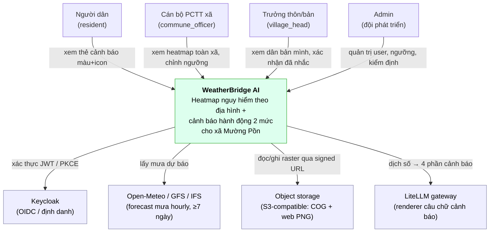
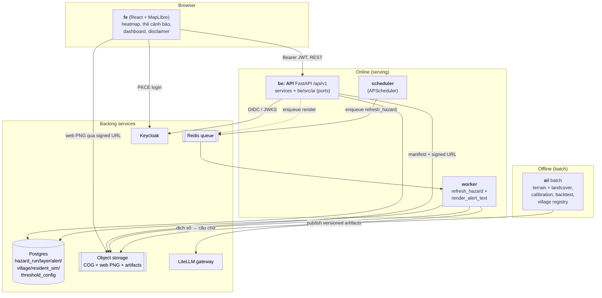
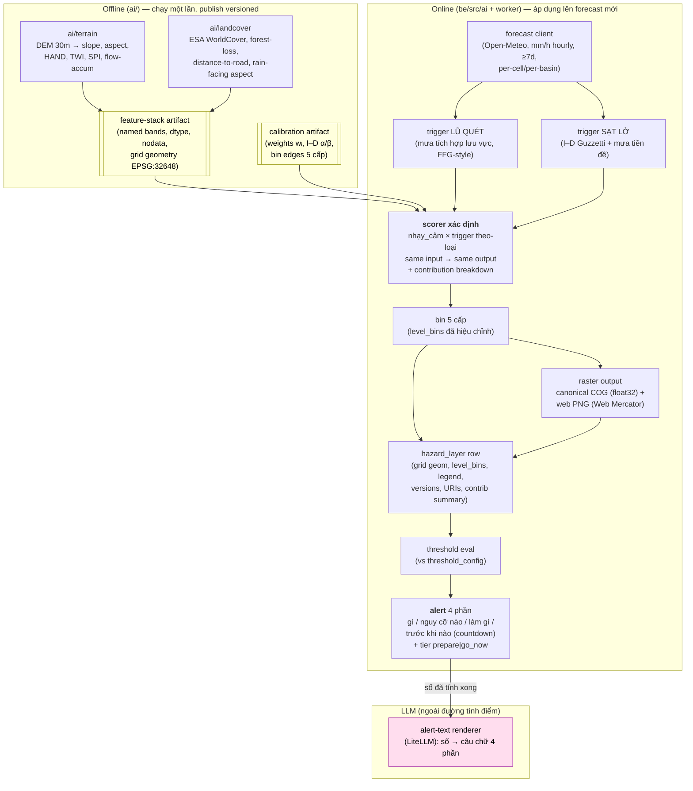
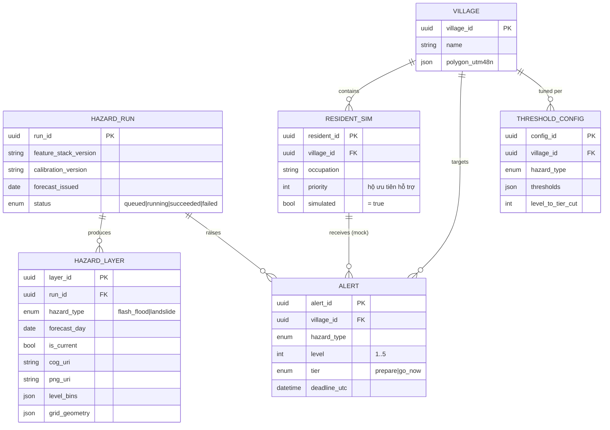

# Solution Design — WeatherBridge AI (MVP)

> Tài liệu này là bản diễn giải dạng văn xuôi (prose companion) của
> `ARCHITECTURE-SPINE.md`. Spine ghi các **bất biến (invariants)** ở dạng cô đọng cho đội build;
> tài liệu này giải thích **lý do đằng sau** cho người đọc ngoài đội — ban giám khảo VAIC 2026 và
> reviewer. Mọi khẳng định ở đây đều truy vết được về một Architecture Decision (AD-1..AD-11)
> trong spine hoặc về PRD/Addendum. Tài liệu **không** đặt ra quyết định kiến trúc mới; khi có mâu
> thuẫn, spine là nguồn chân lý (source of truth).

---

## 1. Tóm tắt kiến trúc

WeatherBridge AI được xây trên một monorepo đã có sẵn và mạch lạc (Keycloak auth, FastAPI async,
worker xếp hàng qua Redis, workspace offline `ai/`, LiteLLM/Langfuse). **Căng thẳng thiết kế trung
tâm** là: bộ khung (scaffold) hiện có được dựng cho một **AI-job generic dạng text→JSON**, trong
khi sản phẩm cần xây là một **sản phẩm raster về nguy hiểm thiên tai (hazard)** — hoàn toàn chưa
tồn tại trong code. Nếu ép domain hazard vào cái khuôn "một job văn bản" thì kiến trúc sẽ trôi dạt
(diverge): điểm số phi xác định, lưới raster không thống nhất giữa fe/be/worker, LLM lẻn vào đường
tính rủi ro. Giải pháp là một **mô thức (paradigm) 3 phần** ăn khớp với các thư mục sẵn có: (1)
**lõi dịch vụ phân tầng theo ports & adapters** — route HTTP mỏng → application service → domain
port (`Protocol`) → adapter, đúng như mẫu đã có trong `be/`; (2) **pipeline hazard kiểu
pipes-and-filters xác định (deterministic)** — rủi ro là một chuỗi biến đổi thuần túy `DEM + land
cover → đặc trưng địa hình → trigger mưa theo-loại → điểm nguy hiểm → 5 cấp → 2 mức → cảnh báo`,
mỗi tầng là một filter có hợp đồng vào/ra rõ ràng, cùng input luôn cho cùng output; (3) **tách
offline (batch) / online (serving)** — công việc geospatial nặng chạy một lần trong `ai/` và xuất
ra **artifact có version**, còn phần serving (`be/src/ai` + `worker/`) chỉ *áp dụng* artifact đó
lên dự báo mới. Ba ý này biến ranh giới có sẵn thành ranh giới chịu tải (load-bearing) cho domain
hazard, để pipeline, API, worker và UI được build song song mà không trôi dạt.

---

## 2. Bối cảnh & ràng buộc

Kiến trúc này **không dựng lại từ số 0**. Nó **phê chuẩn (ratify)** phần hạ tầng đã có và chỉ
**cố định các bất biến mới** mà domain hazard cần.

### 2.1 Kế thừa từ repo hiện có (ratified — giữ nguyên, không thay thế)

- **Xác thực Keycloak** theo OIDC Authorization Code + PKCE (S256); API xác thực JWT qua JWKS
  (issuer/audience/azp). Token **chỉ ở bộ nhớ**, không bao giờ `localStorage`.
- **FastAPI async** với mẫu phân tầng `api/v1` → `services/` → `Protocol` trong `contracts.py` →
  `providers/*`. Đây chính là mẫu ports & adapters mà domain hazard sẽ mở rộng.
- **Worker xếp hàng qua Redis** cho tác vụ bất đồng bộ, tách khỏi tiến trình API (AGENTS.md yêu
  cầu: không train/GPU inference trong tiến trình API).
- **Workspace `ai/` offline** cho chuẩn bị dataset, huấn luyện, đánh giá — tách khỏi serving.
- **LiteLLM gateway + Langfuse** để gọi và trace LLM.
- **Stack ratified:** Python 3.12+, SQLAlchemy async + asyncpg + Alembic, Redis 7.x, PyJWT,
  React 19 + Vite + TanStack Query + Tailwind.
- **Ranh giới sở hữu (AGENTS.md):** `fe/` (UI), `be/` (HTTP/auth/module/migration), `worker/`
  (job bất đồng bộ, deploy độc lập), `be/src/ai/` (provider online, retrieval, inference), `ai/`
  (dataset/train/eval offline), `infra/` (đóng gói runtime, không chứa business logic).

### 2.2 Được quyết định mới trong spine này

- **Domain hazard thành first-class:** 6 bảng mới (`hazard_run`, `hazard_layer`, `alert`,
  `village`, `resident_sim`, `threshold_config`); bảng `ai_jobs` generic của bộ tóm-tắt-văn-bản
  được nghỉ hưu (AD-6).
- **Hợp đồng raster hazard duy nhất** vượt ranh giới: canonical COG (float32, EPSG:32648) + web
  PNG (RGBA, Web Mercator) + một hàng metadata `hazard_layer`; FE không bao giờ nhận lưới thô
  (AD-4).
- **Tách compute offline/online thành load-bearing:** feature-stack tự-mô-tả + calibration là
  artifact có version; thư viện geospatial nặng (`rasterio`, `pysheds`, `pyproj`, `scikit-learn`)
  **cấm** vào image của `be`/`worker` (AD-1).
- **Trigger tách theo loại** (lũ quét ≠ sạt lở) (AD-3); **điểm số xác định, LLM ngoài đường
  tính** (AD-2); **scheduler enqueue, worker execute** (AD-5).
- **Bất biến mới trong stack:** numpy (array ops nhẹ ở worker/serving), APScheduler 3.x, MapLibre
  GL JS 5.x, object storage S3-compatible (Garage/SeaweedFS), Open-Meteo/GFS/IFS forecast API.
- **Tư thế an toàn (safety posture)** được nâng lên thành bất biến kiến trúc (AD-11): disclaimer
  bắt buộc, lệch về recall, luôn hiện độ tin cậy, không quảng bá cá-nhân-hoá-tới-hộ.

---

## 3. Sơ đồ C4

Ba mức C4, vẽ bằng mermaid `flowchart`/`erDiagram` (không dùng cú pháp C4-PlantUML vì mermaid
render kém). Mỗi sơ đồ kèm diễn giải.

### 3.1 Mức 1 — System Context

Ai dùng hệ thống và hệ thống nói chuyện với bên ngoài nào. Có 4 nhóm người dùng (khớp 4 vai RBAC
của AD-8/FR17) và 4 hệ thống ngoài: Keycloak (định danh), Open-Meteo forecast API (mưa dự báo
3–7 ngày), object storage (raster), LiteLLM (dịch số thành câu chữ cảnh báo).

Điểm cần chú ý: LLM (LiteLLM) chỉ nằm ở ngoại vi để **diễn đạt** cảnh báo; nó không tham gia vào
việc tính rủi ro (AD-2). Forecast API là nguồn dữ liệu động duy nhất theo thời gian; toàn bộ độ
phân giải "trong xã" đến từ địa hình chứ không từ thời tiết (AD-11, R3).

### 3.2 Mức 2 — Container

Các container runtime và chiều phụ thuộc. Chiều mũi tên **tuân theo đúng luật dependency-direction
của spine**: `fe → be(API) → services → be/src/ai`; `worker → be/src/ai` + đọc/ghi DB & object
storage; `ai/` **chỉ** xuất artifact và **không bao giờ** import `be`/`worker`. Cấm: `fe` truy cập
trực tiếp DB/Redis/ghi-object-storage; `be/src/ai` hay `worker` import `ai/`; `ai/` import code
serving.

Điểm cần chú ý: tiến trình **API không làm compute hazard** — nó chỉ đọc kết quả và có thể enqueue
job (AD-5). Compute nặng nằm ở worker (chạy pipeline) và ở `ai/` (chuẩn bị artifact). `ai/` đổ
artifact vào object storage; serving chỉ đọc bản đã ghim (pinned) — hai chiều không bao giờ import
lẫn nhau (AD-1). Migration DB do `be` sở hữu, chạy như một release step, không chạy từ replica API.

### 3.3 Mức 3 — Component (pipeline hazard)

Chi tiết bên trong pipeline hazard, làm nổi bật tính chất pipes-and-filters xác định. Hai artifact
offline (feature-stack + calibration) nạp vào scorer; **LLM nằm NGOÀI đường tính điểm** — nó chỉ
nhận số đã tính rồi để diễn đạt.

Điểm cần chú ý: hai artifact màu vàng (feature-stack + calibration) là đầu vào **bất biến, có
version, ghim theo run** cho scorer (AD-1, AD-7). Scorer là hàm thuần túy: không gọi LLM, không gọi
mạng, không ngẫu nhiên (AD-2). Hai trigger tách hẳn nhau — không dùng chung đường cong hay ngưỡng
(AD-3). LLM (màu hồng) chỉ được gọi **sau khi** con số đã cố định; nó phrase, không score (AD-2).
Bin 5 cấp dùng `level_bins` đã hiệu chỉnh theo QĐ 18/2021 (không dùng bins đều cứng, tránh
under-warn — Addendum §1).

---

## 4. Các quyết định kiến trúc (AD-1..AD-11)

| AD | Quyết định (1 dòng) | Vì sao (divergence mà nó chặn) |
| --- | --- | --- |
| **AD-1** | Đặc trưng tĩnh (terrain + land cover) chỉ tính trong `ai/`, publish thành feature-stack artifact tự-mô-tả, index theo tên band; online chỉ áp dụng array-ops. | Chặn thư viện geospatial nặng lẻn vào image serving; chặn tái-dẫn-xuất địa hình phi xác định; chặn đổi version stack làm lệch band mà weight nhân vào. |
| **AD-2** | Điểm nguy hiểm là hàm xác định, phát ra breakdown đóng góp theo ô; LLM chỉ dịch số, ngoài đường tính. | Chặn điểm không giải thích được; chặn LLM âm thầm sửa rủi ro đã tính; chặn contribution tính ra nhưng UI không đọc được. |
| **AD-3** | Mỗi loại thiên tai có bộ weight + hàm trigger RIÊNG (lũ quét = mưa lưu vực FFG; sạt lở = I–D Guzzetti + tiền đề). | Chặn rủi ro sai vật lý (áp đường I–D của sạt lở lên lũ, hay áp trigger mưa cho hazard do nhiệt). |
| **AD-4** | Một hợp đồng raster duy nhất vượt ranh giới: canonical COG (float32, EPSG:32648) + web PNG (Web Mercator) + hàng `hazard_layer`; có con trỏ `current`; lưới thô không qua API. | Chặn fe/be/worker bất đồng về shape/projection/pixel; chặn payload JSON hàng trăm nghìn ô; chặn hai raster tranh nhau làm "current". |
| **AD-5** | Scheduler (APScheduler) enqueue job `refresh_hazard`; worker thực thi toàn chuỗi; API không compute hazard. Mục tiêu độ trễ ≤15 phút. | Chặn compute dài trên thread request API; chặn hai đường thực thi song song cho pipeline. |
| **AD-6** | Domain hazard có bảng riêng, tách khỏi `ai_jobs` generic; đúng một writer mỗi entity; alert idempotent theo `(village_id, hazard_type, forecast_day, tier)`. | Chặn hai chủ sở hữu một entity; chặn schema drift giữa be và worker; chặn cảnh báo trùng khi re-run/retry. |
| **AD-7** | Tách config: calibration (weight, α/β, bin edges, version) là artifact bất biến ghim theo run, fail-closed nếu thiếu; ngưỡng vận hành nằm trong `threshold_config` (Postgres) có audit. | Chặn run không tái lập; chặn ngưỡng hardcode; chặn cán bộ vô tình đổi "khoa học"; chặn scoring âm thầm fallback sai artifact. |
| **AD-8** | 4 vai Keycloak (admin/commune_officer/village_head/resident); mọi query người/hộ/alert scoped theo vai+bản ở tầng service; mọi person `simulated = true`. | Chặn rò rỉ dữ liệu chéo-bản; chặn thu thập PII thật. |
| **AD-9** | Alert phải đủ 4 phần (gì/nguy cỡ nào/làm gì/trước khi nào); `tier` tính một lần ở `be`, lưu trên row; FE không tự suy tier từ level; view dân icon+màu+câu, hành động trước số. | Chặn cảnh báo thiếu/không hành động được; chặn fe và be bất đồng cách 5 cấp → 2 mức; chặn view chữ nhiều không dùng được cho người ít chữ. |
| **AD-10** | Backtest 25/7/2024 chỉ chạy trong `ai/` như entrypoint đánh giá, không bao giờ train (MVP là mức A heuristic); báo recall@τ kèm FPR, ghi caveat sai số nhãn. | Chặn rò rỉ train/eval; chặn trình bày đánh giá như thành tích đã train; chặn quá tin nhãn nhiễu. |
| **AD-11** | Tư thế an toàn là bất biến kiến trúc: disclaimer bắt buộc mọi bề mặt; lệch về recall; luôn hiện độ tin cậy; không claim cá-nhân-hoá-tới-hộ từ thời tiết. | Chặn sản phẩm bị đọc như cảnh báo chính thức; chặn tự tin thái quá âm thầm; chặn over-claim độ phân giải mà dữ liệu không đỡ nổi. |

---

## 5. Luồng dữ liệu chính (data flow)

Một chu kỳ refresh đầy đủ, khi có forecast mới về (AD-5). Từng bước là một filter với hợp đồng
vào/ra rõ ràng.

1. **Scheduler enqueue.** APScheduler phát hiện có forecast mới cho tọa độ Mường Pồn và enqueue
   job `refresh_hazard` lên Redis queue. Scheduler không tính gì, chỉ đặt job (AD-5).
2. **Worker nhận job & tạo hazard_run.** Worker lấy job khỏi queue, tạo hàng `hazard_run` với
   lifecycle `queued → running`, ghim `calibration_version` + `feature_stack_version` cho run này.
   Nếu artifact bị ghim không tồn tại hoặc thiếu provenance → **fail closed** (AD-7).
3. **Fetch forecast.** Worker gọi forecast client (`be/src/ai/forecast`) qua Protocol; nhận về
   chuỗi mưa **theo giờ, mm/h, per-grid-cell (hoặc per-basin), horizon ≥7 ngày**, trên lưới của
   feature-stack (AD-4). Chuỗi điểm-đơn theo ngày là non-conformant.
4. **Áp trigger lên feature stack.** Với mỗi loại, worker áp trigger RIÊNG (AD-3): lũ quét dùng
   mưa tích hợp theo lưu vực phía trên (FFG-style); sạt lở dùng I–D Guzzetti + mưa tiền đề. Đây
   chỉ là array-ops trên feature-stack đã publish — không tái-dẫn-xuất địa hình (AD-1).
5. **Score.** Scorer xác định tính `nhạy_cảm(ô, loại) × trigger(loại)` cho từng ô, phát kèm
   **breakdown đóng góp** theo ô (multi-band contribution raster). Không LLM, không mạng, không
   ngẫu nhiên (AD-2).
6. **Bin 5 cấp + ghi raster.** Điểm liên tục `[0,1]` được bin thành 5 cấp bằng `level_bins` đã
   hiệu chỉnh. Worker ghi, cho mỗi `(hazard_type, forecast_day)`: canonical COG (float32,
   EPSG:32648, nodata=NaN) + web PNG (RGBA, đã áp colormap, reproject Web Mercator) vào object
   storage, và một hàng `hazard_layer` metadata (grid geometry, level_bins, legend, versions,
   contribution summary, 2 URI) (AD-4).
7. **Set current.** Worker upsert con trỏ `current` cho `(hazard_type, forecast_day)`, thay thế
   run cũ. FE và alert chỉ đọc layer current (AD-4).
8. **Evaluate thresholds.** Worker chạy zonal-stat cell→village (`be/src/ai/zonal`) rồi so với
   `threshold_config` (per loại/bản, gồm cả cut level→tier). Vượt ngưỡng → cần cảnh báo (AD-5,
   AD-7).
9. **Create alerts.** Worker tạo `alert` với `tier` (`prepare`|`go_now`) tính **một lần ở đây**,
   idempotent theo `(village_id, hazard_type, forecast_day, tier)` — re-run upsert, không nhân
   bản (AD-6, AD-9). Alert mang đủ khung 4 phần, gồm deadline countdown (absolute UTC).
10. **Enqueue LLM render.** Worker enqueue `render_alert_text`; job này gọi LiteLLM để **diễn đạt**
    con số đã cố định thành 4 câu chữ dễ hiểu (AD-2). LLM không đổi số nào.
11. **FE đọc & render.** FE gọi API lấy **manifest + signed URL** của layer current (không lấy
    lưới thô), tải web PNG qua signed URL từ object storage, render heatmap trên MapLibre (per-type
    + combined "dominant hazard" là overlay dẫn xuất phía FE), và render thẻ cảnh báo cho dân
    (icon + màu + câu hành động trước, số dưới) kèm disclaimer + độ tin cậy (AD-4, AD-9, AD-11).
    Người dùng click ô → cell-inspect endpoint trả breakdown đóng góp (AD-2).

---

## 6. Mô hình dữ liệu

6 bảng domain, `be` sở hữu schema + toàn bộ migration Alembic; đúng **một writer mỗi entity**
(AD-6). Khóa chính UUID; snake_case; thời gian ISO-8601 UTC.

Cột & luật khóa quan trọng (từ spine):

- **hazard_run** — writer là **worker** (tạo row đầu job, chuyển status qua helper). Ghim
  `feature_stack_version` + `calibration_version` (AD-6, AD-7).
- **hazard_layer** — writer là **worker**. Khóa `(run_id, hazard_type, forecast_day)` với con trỏ
  `current` per `(hazard_type, forecast_day)`. `grid_geometry` copy verbatim từ feature-stack
  header, không khai lại hằng số ở be/worker/fe (AD-4).
- **alert** — writer là **worker**. Idempotent trên `(village_id, hazard_type, forecast_day,
  tier)`. `tier` tính một lần ở be và lưu ở đây; FE không suy lại (AD-6, AD-9).
- **village** — seed bởi **be** từ village-registry artifact (ids + polygon EPSG:32648); không ai
  tự hand-author identity/geometry bản (convention village registry).
- **resident_sim** — writer là **be**. Mọi hàng `simulated = true`; trường triage tên `priority`
  ("hộ ưu tiên hỗ trợ", tránh từ kỳ thị) (AD-8, convention non-stigmatizing).
- **threshold_config** — writer là **be** (config + write người dùng). Ngưỡng vận hành + cut
  level→tier, có audit trail; cán bộ chỉ chạm bảng này, không chạm calibration (AD-7, AD-9).

---

## 7. Bảo mật, an toàn & tuân thủ

- **RBAC 4 vai + data-scoping (AD-8).** 4 realm role Keycloak: `admin`, `commune_officer`,
  `village_head`, `resident`. Data-scoping thực hiện ở **tầng service, không ở UI**:
  `village_head` chỉ thấy bản mình, `commune_officer` thấy cả xã, `resident` chỉ thấy của mình.
  Auth theo OIDC Authorization Code + PKCE (S256); API validate JWT qua JWKS; **token chỉ ở bộ
  nhớ, không bao giờ `localStorage`** (NFR6).
- **Chỉ PII giả lập (Nghị định 13/2023).** Hồ sơ dân/hộ là dữ liệu cá nhân → cần cơ sở đồng thuận
  hợp pháp. MVP **không thu thập/không lưu PII thật**; mọi person `simulated = true` (AD-8, PRD §8,
  G5). Signed URL của object storage ngắn hạn — nhưng vì raster hazard là non-PII phủ toàn xã,
  scoping URL chỉ là vệ sinh khả dụng, không phải ranh giới bảo mật.
- **Disclaimer bắt buộc (AD-11).** Chuỗi *"công cụ hỗ trợ, không thay cảnh báo chính thức của cơ
  quan KTTV/PCTT"* render trên **mọi** bề mặt hazard/alert, qua một component FE chia sẻ, string
  sở hữu ở một nơi duy nhất (NFR1).
- **Lệch về recall hơn precision (AD-11, NFR1).** Scoring và ngưỡng cố ý lệch về giảm bỏ sót ô
  nguy hiểm, chấp nhận nhiều báo động giả hơn — bias này **tường minh**, không tình cờ. Luôn hiện
  **độ tin cậy** cạnh mọi cấp/cảnh báo.
- **LLM ngoài đường tính điểm (AD-2, NFR7).** LLM chỉ được gọi bởi alert-text renderer với số đã
  tính xong; không LLM/mạng/ngẫu nhiên trong score. Điểm là hàm xác định, giải thích được qua
  cell-inspect.
- **Provenance / versioning + fail-closed (AD-7, AD-10).** calibration/feature-stack là artifact
  bất biến, version monotonic (`calib-YYYYMMDD-N`/`stack-YYYYMMDD-N`) hoặc content hash, đăng ký
  provenance trong `docs/compliance/` trước khi dùng; scoring **fail closed** nếu artifact/
  provenance thiếu. Không đưa secret/model weight/PII thật/`.env` vào Git.
- **Không claim cá-nhân-hoá-tới-hộ từ thời tiết (AD-11, R3).** Weather ~9–25 km; độ phân giải
  trong xã đến từ địa hình. Copy và UI nói rõ điều này.

---

## 8. Ranh giới MVP (Deferred)

Những gì **cố ý để ngoài** MVP (đều từ mục Deferred của spine / Phi mục tiêu PRD):

- **ML mức B/C** (logistic / RandomForest / XGBoost với weight học được): cần inventory vùng Tây
  Bắc; MVP là heuristic mức A. Revisit khi có inventory.
- **Đa kênh & last-mile relay** (FR13–FR16, NFR2): loa/TTS Mông–Thái, SMS, âm thanh Amber-Alert,
  tiếp cận không-smartphone, nhật ký trách nhiệm, escalation — Roadmap; MVP chỉ mô phỏng. TTS phải
  qua kiểm định người bản ngữ trước khi dispatch thật (sai nghĩa = rủi ro tính mạng).
- **Định tuyến sơ tán** (FR12, "chạy đi đâu"): cần lớp điểm an toàn + routing — Roadmap.
- **Lớp rét hại / sương muối / mưa lớn**: cần **trigger NHIỆT** (không phải mưa) — mô hình riêng,
  không phải biến thể của 2 trigger lõi (Addendum §1). Roadmap.
- **PII thật / luồng đồng thuận** (Nghị định 13/2023): MVP chỉ dữ liệu giả lập; cần cơ sở pháp lý
  trước khi dùng dữ liệu dân thật.
- **Cloud deployment target & Terraform**: `infra/terraform/` để README-only tới khi chọn nhà
  cung cấp; object storage/secret manager/managed Postgres-Redis chọn lúc đó.
- **Hiệu chỉnh cục bộ I–D α/β và bin edges**: MVP ship giá trị Guzzetti toàn cầu (flag over-warn);
  hiệu chỉnh cục bộ là một bản sửa artifact calibration khi có inventory (không đổi AD nào).
- **Gói forecast thương mại**: Open-Meteo free tier là non-commercial; deployment vận hành cần gói
  trả phí hoặc self-host (forecast Protocol giữ điều này swappable).

---

## 9. Rủi ro kỹ thuật đã biết

| Rủi ro | Bản chất & cách xử lý |
| --- | --- |
| **Ngưỡng Guzzetti toàn cầu hay báo thừa (R1)** | α=2,20; β=−0,44 toàn cầu (Guzzetti 2008) hay over-warn ở thời lượng dài. MVP ship giá trị này có **flag over-warn**; đường ra là hiệu chỉnh α/β địa phương từ inventory Tây Bắc — một bản sửa artifact calibration, không đổi AD (AD-7, Addendum §3). |
| **Backtest small-n (R2, R4, AD-10)** | Tập dương từ 1 sự kiện (25/7/2024) chỉ 2–3 bản → thống kê không vững, recall đơn lẻ gian lận được (tô đỏ hết → recall=1). Xử lý: báo recall@τ **kèm FPR**, ưu tiên "top phân vị nguy hiểm", đánh dấu rõ là đánh giá nội bộ; ROC-AUC vùng là stretch. Không train từ nhãn này. |
| **Sai số vị trí nhãn COOLR ≫30 m (AD-10, Addendum §5)** | Nhãn COOLR có sai số vị trí lớn hơn 30 m nhiều → caveat được **carry trên mọi kết quả backtest**; nhãn hiện là bootstrap, không lên slide như thành tích tới khi có nhãn thật. |
| **Open-Meteo ToS non-commercial** | Free tier non-commercial (data CC BY 4.0, cần attribute). MVP dùng được; deployment vận hành cần gói trả phí/self-host. forecast Protocol giữ nguồn swappable (Stack, Deferred). |
| **Weather ~9–25 km, độ phân giải trong xã từ địa hình (R3, AD-11)** | Lưới forecast thô hơn quy mô bản rất nhiều. Độ phân giải "trong xã" đến hoàn toàn từ đặc trưng địa hình (feature-stack ≤100 m). UI/copy **không** quảng bá "cá nhân hoá tới hộ" ở phần thời tiết. |

---

*Hết. Tài liệu này diễn giải spine; khi có mâu thuẫn, `ARCHITECTURE-SPINE.md` thắng.*
